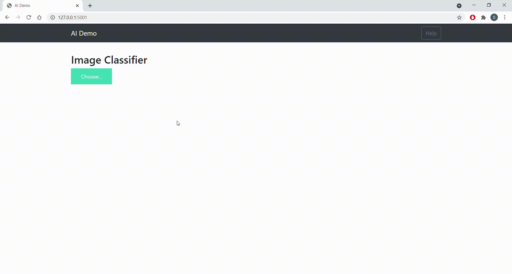

## Cotton Disease image classification with Resnet152V2

In this model is trained to classify the images of the cotton plant whether it is healthy or a diseased leaf


## DataSet
The data set is divided into 3 folders train,test and val. Each of the folder contains the 4 different folders 
- diseased cotton leaf
- diseased cotton plant
- fresh cotton leaf
- fresh cotton plant
 
 ## Data source link
 
 Kaggle
 https://www.kaggle.com/janmejaybhoi/cotton-disease-dataset

  
## Technologies Used

 - Python 3.6
 - Flask
 - jQuery
 - CSS
 - HTML
  
## Run Locally

Clone the project

```bash
  git clone git@github.com:schandrab22/CottonDisease.git
```

Go to the project directory

```bash
  cd my-project
```

Install dependencies

```bash
  pip install -r requirements.txt
```

Start the server

```bash
  run app.py
```

  
